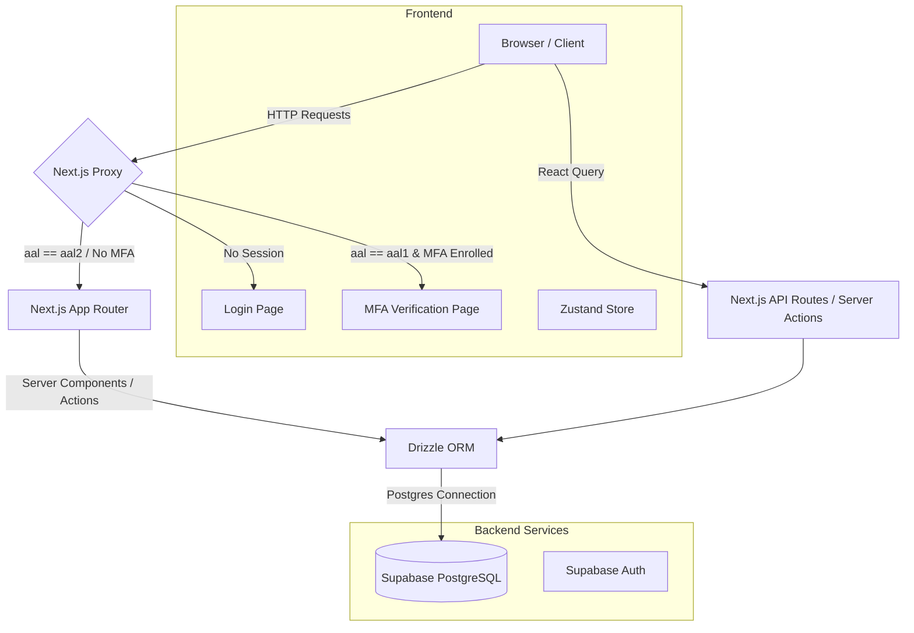

# Architecture

This document outlines the high-level system architecture, data flow, and infrastructure choices for the Prestige Box application.

## System Overview

Prestige Box is built using a modern, serverless architecture that separates the frontend application from the backend database and authentication services. The application relies on **Next.js (App Router)** for rendering and routing, and **Supabase** for PostgreSQL database hosting and Authentication.

## Frontend: Next.js App Router

The application heavily utilizes the **Next.js App Router (`src/app`)**, which enables React Server Components by default. This provides several benefits:

- **Reduced Bundle Size**: Most of the data fetching logic remains on the server, ensuring the client bundle remains small.
- **Improved Performance**: Initial page loads are fully rendered HTML.
- **Server Actions**: Mutations (e.g., submitting forms, updating database records) are executed via Next.js Server Actions rather than traditional API routes, streamlining the developer experience.

### Route Structure

- `src/app/(external)`: Public landing page and marketing entry points.
- `src/app/(main)`: Core authenticated portal. Contains:
  - `auth/`: Authentication flow routes (Login, Password Reset, MFA enrollment and verification).
  - `dashboard/crm/`: Client Relationship Management dashboards (Overview with assigned opportunities card `<AssignedOpportunitiesCard />`, Notes, Tasks, Opportunities, and Workflows) and CRM registries (Households, Clients, Companies, People, Addresses, Policies, Professional Services). Selecting a Client (`/dashboard/crm/clients/[id]`), Company (`/dashboard/crm/companies/[id]`), or Household (`/dashboard/crm/households/[id]`) dynamically switches the sidebar to a tailored contextual navigation menu. Internal client and company workspaces (`/dashboard/crm/clients/[id]/internal` & `/dashboard/crm/companies/[id]/internal`) include `<NotebookButton />` / `<CompanyNotebookButton />` launching external OneNote notebook URLs (`notebook_url`). Viewing a Person profile (`/dashboard/crm/people/[id]`) displays general details, client linkage, professional firm associations, a `PersonNotesCard`, and a dedicated Notes tab.
  - `dashboard/crm/households/[id]`: Household detail workspace containing Overview (net worth timeline & portfolio rollup chart), Family Tree (interactive visual family hierarchy), Assets, Liabilities, Estate Planning, Policy categories (Life, Disability, LTC, P&C), Managed Accounts & Servicing Institutions (Banks, Money Managers, Record Keepers), Professional Associations (Law, Accounting, Actuarial), Employment, and Internal workspace (Notes, Tasks, Opportunities, Workflows, History).
  - `dashboard/admin/`: Admin panels (User management & role settings, Advisory Teams Management at `/dashboard/admin/teams` with drag-and-drop member assignment, Workflow template visual graph designer, and Opportunity Pipeline stages setup with default AUM % configuration).
  - `dashboard/reports/`: Analytical charts (expected Benefit Payments report, Relationship Graph SVG, audit History Report, and interactive Referrals report tree).
  - `dashboard/finance/`: Client asset/liability listings and insurance policies overview.

## Backend: Supabase

**Supabase** acts as the primary Backend-as-a-Service (BaaS) for Prestige Box.

### Authentication & Multi-Factor Authentication (MFA)

Authentication and MFA are handled by Supabase Auth.

- Next.js **Proxy** (`src/proxy.ts`) intercepts requests to `/dashboard` and `/api` to ensure security. It parses the Supabase authentication cookie (`sb-*-auth-token`), decodes the JWT, and inspects the `aal` (Authenticator Assurance Level) claim. Authentication and user lookups enforce case-insensitive email synchronization (`supabase/migrations/20260721152236_case_insensitive_user_sync.sql`).
- **Strict MFA Gate**: If the user is unauthenticated, they are redirected to `/login`. If the session is active but the current level is `aal1` (single factor authenticated) and the user has a verified MFA factor enrolled, the proxy redirects them to the `/auth/mfa-verify` page to enter their TOTP token. Access to dashboard routes and protected APIs is only granted once `aal2` (multi-factor authenticated) is achieved.
- **MFA Test Bypass**: For automated Playwright E2E tests and local dev sandbox validation, a bypass is supported via the environment variable `NEXT_PUBLIC_BYPASS_MFA=true`. When active, it bypasses the AAL2 / TOTP checks at the callback page, login flow, and client-side auth provider layers, allowing smooth automated browser flows.
- Sessions are managed via cookies, allowing server components to safely read the user's authentication state on initial load.
- Users can enroll, verify, and view their authentication factors (TOTP and native WebAuthn Passkeys) on the Security Settings page (`/dashboard/settings`).

### Database Connection

Instead of using the Supabase Javascript Client to execute database queries directly against the PostgREST API, Prestige Box connects to the Supabase Postgres database directly using **Drizzle ORM** via standard connection pooling.

### Storage

- **File & Asset Storage**: Logos, avatars, and documents are stored securely using Supabase Storage. Brand assets (such as Money Manager, Record Keeper, and corporate logos) are hosted in the `avatars` bucket, while sensitive client policy and estate planning files are uploaded to secure private storage folders.
- **Google Drive Integration**: Direct integration with Google Drive via backend Server Actions (`src/actions/google-drive.ts`) and modal UI picker primitives (`src/components/tasks/gdrive-picker-dialog.tsx`). Users can search, view details, select, and link external Google Drive documents directly to Tasks, Workflow steps, Opportunities, and Threaded Notes without storing binary file duplicates.

## State Management

Prestige Box employs a dual-tier state management strategy:

1. **Global Client State (Zustand)**
   - Used for UI state that must be shared across disparate client components (e.g., sidebar toggles, theme preferences, global modal states).
   - Zustand provides a minimal API with excellent TypeScript support.

2. **Server State (TanStack React Query)**
   - Used for complex client-side data fetching, pagination, and caching.
   - React Query handles loading states, background refetching, and caching synchronization when navigating between client pages.

## Observability & Logging (Axiom)

Prestige Box integrates **Axiom** for telemetry, performance tracing, and secure application logging.

- **Request Wrapping**: Next.js configurations (`next.config.mjs`) wrap settings with `withAxiom` to capture server-side runtimes, request paths, and API latencies.
- **WebVitals Tracking**: Root layouts mount `<AxiomWebVitals />` to capture real user monitoring (RUM) metrics like LCP, FID, CLS, and TTFB.
- **Client & Server Logging**: Telemetry hooks (`useLogger` from `next-axiom`) are integrated within critical client components (such as `LoginForm` and `ClientSetupForm`) to securely stream application events (successful sign-ins, onboarding completions, and unhandled errors) to Axiom without exposing sensitive details.

## Security & Web Protections

Prestige Box enforces strict security boundaries at multiple layers:

- **HTTP Security Headers**: Next.js configurations (`next.config.mjs`) inject robust security headers across all routes to prevent common web vulnerabilities:
  - `X-Frame-Options: DENY` and `Content-Security-Policy: frame-ancestors 'none'` to block Clickjacking attacks.
  - `X-Content-Type-Options: nosniff` to prevent MIME-type sniffing.
  - `Referrer-Policy: strict-origin-when-cross-origin` to limit referrer leaks.
- **Multi-Factor Authentication (MFA)**: Strict AAL2 verification is enforced at the routing and database levels.

## Asset History & Net Worth Visualization

To support advisor insights and client/household financial planning, the application tracks historical asset values and aggregates multi-entity portfolios:

- **Snapshots**: Every time an asset is created or its value is updated, a historical record is automatically appended to `asset_history` via backend Server Actions.
- **Financial & Portfolio Rollup Engines (`src/lib/financial-rollup.ts` & `src/lib/portfolio-rollup.ts`)**: Core financial calculation modules that derive total net worth, liquid assets, total debt, debt-to-income ratio, and asset allocation breakdown (Equities, Fixed Income, Real Estate, Cash, Insurance, etc.). Computations aggregate wealth across physical assets, liabilities, and managed accounts for both individual clients and household units.
- **Virtual Asset Integration**: To keep client and household Net Worth data complete and accurate, money manager accounts and record keeper accounts managed under clients or household members are automatically projected as read-only virtual assets. Their values contribute to chronological Net Worth calculations and portfolio rollups alongside physical assets.
- **Chronological Aggregation**: Server actions construct a unified chronological net worth timeline for clients and households by merging overlapping asset values on shared dates.
- **Rendering**: Recharts is used on the client-side to render interactive, beautiful area charts showing net worth growth and individual asset category distributions over time (`household-net-worth-chart.tsx`).

## Opportunity Pipeline Analytics & Financial Modeling

The CRM Opportunities module provides real-time pipeline aggregation and deal velocity analytics:

- **Pipeline Summary Engine**: Server actions and React components (`src/components/crm/opportunities/_components/pipeline-summary-section.tsx`) aggregate raw opportunity records into multi-axis analytical summaries.
- **Stage Metrics**: Computes gross pipeline value, weighted pipeline value (factoring probability win percentages), stage contribution percentage of total volume, average stage win probabilities, and target close date change velocity (tracking date extensions and shifts).
- **Default Fee Configurations**: System administrators can configure default AUM fee percentages and stage parameters under `/dashboard/admin/opportunities`, enabling instant revenue projections across active deal stages.

## Deployment & CI/CD Pipelines

Prestige Box uses GitHub Actions and Vercel for automation, testing, and deployment:

- **Deployment Environments**:
  - `dev` (Development): Runs security vulnerability scanning.
  - `preview` (Preview): Deploys pull requests dynamically for staging and testing.
  - `pre-prod` (Pre-production): Near-production environment for release verification.
  - `main` (Production): Live environment for clients and advisors.
- **CI/CD Automation Flow**:
  - **Snyk Vulnerability Scan**: Development builds trigger dependency audits using Snyk to block security risks.
  - **Automated Database Migrations**: Push to deployment environments triggers the database schema migration utility (`src/db/migrate.ts`) to keep databases in sync with Drizzle ORM schemas.
  - **Vercel Build & Deployment**: Frontend assets are compiled and deployed to Vercel via GitHub actions.

## Tooling & Quality Assurance

- **Biome**: Chosen over ESLint/Prettier for extremely fast, opinionated formatting and linting.
- **TypeScript**: Strict typing is enforced across the stack, bridging database schemas (Drizzle) with UI props.
- **Playwright**: Comprehensive E2E testing suite (`e2e/`) is used to test critical auth flows, responsive layout designs, and client dashboard features across desktop and mobile viewpoints.
