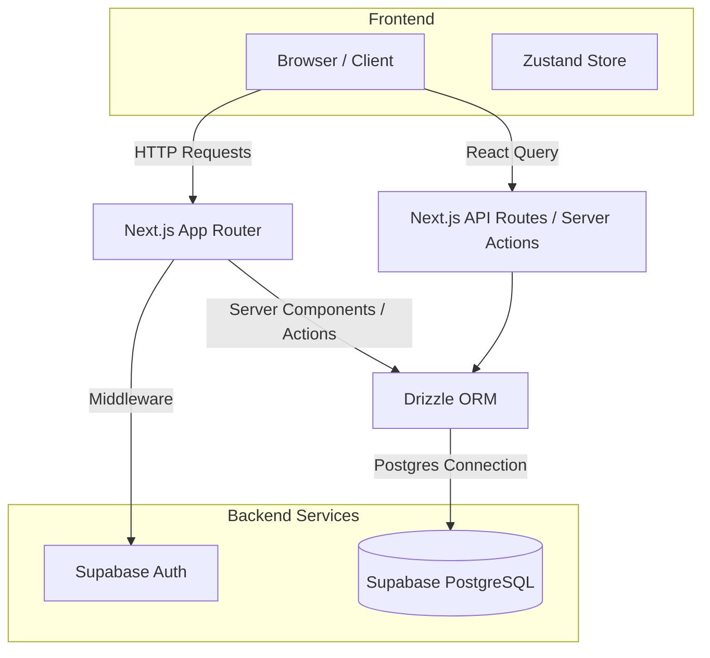

# Architecture

This document outlines the high-level system architecture, data flow, and infrastructure choices for the Prestige Box application.

## System Overview

Prestige Box is built using a modern, serverless architecture that separates the frontend application from the backend database and authentication services. The application relies on **Next.js (App Router)** for rendering and routing, and **Supabase** for PostgreSQL database hosting and Authentication.

## Frontend: Next.js App Router

The application heavily utilizes the **Next.js App Router (`src/app`)**, which enables React Server Components by default. This provides several benefits:
- **Reduced Bundle Size**: Most of the data fetching logic remains on the server, ensuring the client bundle remains small.
- **Improved Performance**: Initial page loads are fully rendered HTML.
- **Server Actions**: Mutations (e.g., submitting forms, updating database records) are executed via Next.js Server Actions rather than traditional API routes, streamlining the developer experience.

### Route Structure
- `src/app/(external)`: Public-facing pages (e.g., Login, Password Reset).
- `src/app/(main)`: Authenticated routes containing the core application dashboard and features.

## Backend: Supabase

**Supabase** acts as the primary Backend-as-a-Service (BaaS) for Prestige Box.

### Authentication
Authentication is handled entirely by Supabase Auth.
- Next.js **Middleware** intercepts requests to ensure unauthenticated users cannot access `(main)` routes and are redirected to the login page.
- Sessions are managed via cookies, allowing server components to safely read the user's authentication state on initial load.

### Database Connection
Instead of using the Supabase Javascript Client to execute database queries directly against the PostgREST API, Prestige Box connects to the Supabase Postgres database directly using **Drizzle ORM** via standard connection pooling.

## State Management

Prestige Box employs a dual-tier state management strategy:

1. **Global Client State (Zustand)**
   - Used for UI state that must be shared across disparate client components (e.g., sidebar toggles, theme preferences, global modal states).
   - Zustand provides a minimal API with excellent TypeScript support.

2. **Server State (TanStack React Query)**
   - Used for complex client-side data fetching, pagination, and caching.
   - React Query handles loading states, background refetching, and caching synchronization when navigating between client pages.

## Observability & Logging (Axiom)

Prestige Box integrates **Axiom** for telemetry, performance tracing, and secure application logging.
- **Request Wrapping**: Next.js configurations (`next.config.mjs`) wrap settings with `withAxiom` to capture server-side runtimes, request paths, and API latencies.
- **WebVitals Tracking**: Root layouts mount `<AxiomWebVitals />` to capture real user monitoring (RUM) metrics like LCP, FID, CLS, and TTFB.
- **Client & Server Logging**: Telemetry hooks (`useLogger` from `next-axiom`) are integrated within critical client components (such as `LoginForm` and `ClientSetupForm`) to securely stream application events (successful sign-ins, onboarding completions, and unhandled errors) to Axiom without exposing sensitive details.

## Asset History & Net Worth Visualization

To support advisor insights and client financial planning, the application tracks historical asset values:
- **Snapshots**: Every time an asset is created or its value is updated, a historical record is automatically appended to `asset_history` via backend Server Actions.
- **Chronological Aggregation**: Server actions construct a unified chronological net worth timeline for each client by merging overlapping asset values on shared dates.
- **Rendering**: Recharts is used on the client-side to render an interactive, beautiful area chart showing net worth growth and individual asset category distributions over time.

## Tooling & Quality Assurance

- **Biome**: Chosen over ESLint/Prettier for extremely fast, opinionated formatting and linting.
- **TypeScript**: Strict typing is enforced across the stack, bridging database schemas (Drizzle) with UI props.
- **Playwright**: Comprehensive E2E testing suite (`e2e/`) is used to test critical auth flows, responsive layout designs, and client dashboard features across desktop and mobile viewpoints.
