# Database

This document details the database schema, security rules, and data access patterns for the Prestige Box application.

## Schema Overview

The database is built on **PostgreSQL** hosted by Supabase. Schema definitions and migrations are managed by **Drizzle ORM**.

```mermaid
erDiagram
    USERS ||--o{ CLIENTS : "is managed by (role)"
    PEOPLE ||--o{ CLIENTS : "is a"
    PEOPLE ||--o{ HOUSEHOLDS : "belongs to"
    ADDRESSES ||--o{ PEOPLE : "lives at"
    COMPANIES ||--o{ CLIENTS : "employs/associated"
    CLIENTS ||--o{ CLIENT_POLICIES : "holds"
    LIFE_INSURANCE_COMPANIES ||--o{ CLIENT_POLICIES : "issues"
    DISABILITY_INSURANCE_COMPANIES ||--o{ CLIENT_POLICIES : "issues"
    LONG_TERM_CARE_INSURANCE ||--o{ CLIENT_POLICIES : "issues"
    CLIENTS ||--o{ ASSETS : "owns"
    ADDRESSES ||--o{ ASSETS : "located at"
    ASSETS ||--o{ ASSET_HISTORY : "tracks value changes in"
    
    COMPANIES ||--o{ COMPANY_VALUATION_HISTORY : "has valuations"
    COMPANIES ||--o{ COMPANY_OWNERS : "has owners"
    PEOPLE ||--o{ COMPANY_OWNERS : "owns equity"
    
    USERS ||--o{ TASKS : "creates"
    TASKS ||--o{ TASK_ASSIGNEES : "assigned to"
    USERS ||--o{ TASK_ASSIGNEES : "gets tasks"
    TASKS ||--o{ TASK_ASSOCIATIONS : "links entity"
    
    USERS ||--o{ NOTES : "writes"
    NOTES ||--o{ NOTES : "parent/replies"
    NOTES ||--o{ NOTE_ASSOCIATIONS : "links entity"
    NOTES ||--o{ NOTE_ATTACHMENTS : "has uploads"
    NOTES ||--o{ NOTE_REACTIONS : "gets emoji"
    NOTES ||--o{ NOTE_VOTES : "voted by"
    NOTES ||--o{ NOTE_NOTIFICATIONS : "alerts user"
    
    USERS ||--o{ CHANGE_HISTORY : "acts on (actorId)"
    REFERRAL_TYPES ||--o{ CLIENTS : "referred client"
    MONEY_MANAGERS ||--o{ CLIENTS : "manages accounts"
    RECORD_KEEPERS ||--o{ CLIENTS : "records accounts"
    CLIENTS ||--o{ LAW_FIRMS : "associated with"
    COMPANIES ||--o{ LAW_FIRMS : "associated with"
    CLIENTS ||--o{ ACCOUNTING_FIRMS : "associated with"
    COMPANIES ||--o{ ACCOUNTING_FIRMS : "associated with"
    CLIENTS ||--o{ ACTUARIAL_FIRMS : "associated with"
    COMPANIES ||--o{ ACTUARIAL_FIRMS : "associated with"
    CLIENTS ||--o{ BANKS : "associated with"
    COMPANIES ||--o{ BANKS : "associated with"
    CLIENTS ||--o{ PROPERTY_AND_CASUALTY_FIRMS : "associated with"
    COMPANIES ||--o{ PROPERTY_AND_CASUALTY_FIRMS : "associated with"
    
    USERS {
        uuid uid PK "References auth.users"
        string email
        string firstName
        string lastName
        string role "Admin | Advisor | Client"
        string photoURL
        timestamp createdAt
        timestamp updatedAt
    }
    ADDRESSES {
        uuid id PK
        string street1
        string street2
        string city
        string state
        string zipCode
        string country
        timestamp createdAt
        timestamp updatedAt
    }
    PEOPLE {
        uuid id PK
        string prefix
        string firstName
        string middleName
        string lastName
        string suffix
        string photoUrl
        jsonb emails
        jsonb phones
        jsonb socialMedia
        jsonb addresses
        uuid[] addressIds
        timestamp createdAt
        timestamp updatedAt
    }
    HOUSEHOLDS {
        uuid id PK
        string name
        uuid addressId FK
        jsonb memberIds
        timestamp createdAt
        timestamp updatedAt
    }
    CLIENTS {
        uuid id PK
        uuid personId FK "References people"
        uuid advisorId FK "References users"
        uuid referredById FK
        string referredByType
        uuid referredByCompanyId FK
        uuid referredByPersonId FK
        uuid referredByReferralTypeId FK
        uuid referredByEventId FK
        uuid referredByAdvisorId FK
        string[] hobbies
        string[] favoriteSportsTeams
        jsonb paymentAccounts
        jsonb familyMembers
        jsonb employments
        jsonb pcDocuments
        jsonb lifeDocuments
        jsonb ltcDocuments
        jsonb estateDocuments
        jsonb lifePolicies
        jsonb disabilityPolicies
        jsonb ltcPolicies
        jsonb moneyManagerAccounts
        jsonb recordKeeperAccounts
        jsonb liabilities
        jsonb mortgages
        jsonb driversLicense
        jsonb pii
        string documentUrl
        string notebookUrl
        timestamp createdAt
        timestamp updatedAt
    }
    COMPANIES {
        uuid id PK
        string name
        string dba
        string ein
        uuid addressId FK
        string website
        string phone
        uuid advisorId FK "References users"
        jsonb situsRecords
        jsonb nexusRecords
        jsonb paymentAccounts
        jsonb lifeDocuments
        jsonb disabilityDocuments
        jsonb ltcDocuments
        string logoUrl
        jsonb socialMedia
        string documentUrl
        string notebookUrl
        numeric estimatedValue
        timestamp createdAt
        timestamp updatedAt
    }
    COMPANY_VALUATION_HISTORY {
        uuid id PK
        uuid companyId FK
        numeric value
        timestamp valuationDate
        timestamp createdAt
        timestamp updatedAt
    }
    COMPANY_OWNERS {
        uuid id PK
        uuid companyId FK "References companies"
        uuid personId FK "References people"
        numeric ownershipPercentage
        timestamp createdAt
        timestamp updatedAt
    }
    CLIENT_POLICIES {
        uuid id PK
        uuid clientId FK
        uuid lifeInsuranceCompanyId FK
        uuid disabilityInsuranceCompanyId FK
        uuid longTermCareInsuranceId FK
        string paymentAccountId
        string policyName
        string policyNumber
        numeric premiumAmount
        timestamp effectiveDate
        timestamp renewalDate
        string paymentSchedule
        timestamp createdAt
        timestamp updatedAt
    }
    ASSETS {
        uuid id PK
        uuid clientId FK
        string name
        string category
        string subType
        numeric currentValue
        string currency
        boolean isAutomated
        string institutionName
        uuid addressId FK
        timestamp createdAt
        timestamp updatedAt
    }
    ASSET_HISTORY {
        uuid id PK
        uuid assetId FK
        numeric value
        timestamp recordedAt
        timestamp createdAt
    }
    TASKS {
        uuid id PK
        string name
        string status "New | In Process | Waiting Input | Complete"
        string category "Other | Birthday | Wedding Anniversary | Policy Renewal"
        string priority "Low | Medium | High"
        string description "Tiptap HTML"
        jsonb attachments
        timestamp dueDate
        timestamp completeDate
        string source "manual | auto"
        string sourceType "birthday | anniversary | renewal"
        string sourceRefId "anchor ID"
        uuid createdBy FK "References users"
        timestamp createdAt
        timestamp updatedAt
    }
    TASK_ASSIGNEES {
        uuid id PK
        uuid taskId FK
        uuid userId FK "References users"
        timestamp createdAt
    }
    TASK_ASSOCIATIONS {
        uuid id PK
        uuid taskId FK
        string entityType "client | company"
        uuid entityId
        timestamp createdAt
    }
    NOTES {
        uuid id PK
        uuid parentId FK "self-reference"
        uuid rootId FK "self-reference"
        integer depth
        string title "Only on top-level notes"
        string body "Tiptap HTML"
        uuid authorId FK "References users"
        integer score
        boolean isDeleted
        timestamp createdAt
        timestamp updatedAt
    }
    NOTE_ASSOCIATIONS {
        uuid id PK
        uuid noteId FK "References notes"
        string entityType "client | company | person"
        uuid entityId
        timestamp createdAt
    }
    NOTE_ATTACHMENTS {
        uuid id PK
        uuid noteId FK
        string kind "file | link"
        string fileUrl
        string fileName
        integer fileSize
        string mimeType
        string linkUrl
        string linkTitle
        string linkFavicon
        string linkProvider "google-drive | web"
        timestamp createdAt
    }
    NOTE_REACTIONS {
        uuid id PK
        uuid noteId FK
        uuid userId FK "References users"
        string emoji
        timestamp createdAt
    }
    NOTE_VOTES {
        uuid id PK
        uuid noteId FK
        uuid userId FK "References users"
        integer value "1 | -1"
        timestamp createdAt
    }
    NOTE_NOTIFICATIONS {
        uuid id PK
        uuid noteId FK
        uuid rootId FK
        uuid recipientId FK "References users"
        uuid actorId FK "References users"
        string actorName
        string type "mention | reply"
        string preview
        boolean isRead
        timestamp createdAt
    }
    NOTE_ASSOCIATIONS {
        uuid id PK
        uuid noteId FK
        string entityType "client | company | person"
        uuid entityId
        timestamp createdAt
    }
    KEYVALS {
        string id PK
        string value
        timestamp createdAt
        timestamp updatedAt
    }
    CHANGE_HISTORY {
        uuid id PK
        string entityType "client | company | task | team"
        uuid entityId
        string subType "Profile | Life Insurance | etc"
        string action "created | updated | added | removed | deleted"
        string fieldName
        string fieldLabel
        string oldValue
        string newValue
        string summary
        uuid actorId FK "References users"
        string actorName
        timestamp changedAt
        timestamp createdAt
    }
    TEAMS ||--o{ TEAM_MEMBERS : "has members"
    USERS ||--o{ TEAM_MEMBERS : "belongs to"
    TEAMS ||--o{ WORKFLOW_TEMPLATES : "owns template"
    TEAMS ||--o{ WORKFLOW_INSTANCES : "owns instance"
    
    TEAMS {
        uuid id PK
        string name
        string description
        timestamp createdAt
        timestamp updatedAt
    }
    TEAM_MEMBERS {
        uuid id PK
        uuid teamId FK "References teams"
        uuid userId FK "References users"
        timestamp createdAt
    }
    
    WORKFLOW_TEMPLATES ||--o{ WORKFLOW_TEMPLATE_STEPS : "contains"
    WORKFLOW_TEMPLATES ||--o{ WORKFLOW_INSTANCES : "instantiates"
    WORKFLOW_INSTANCES ||--o{ WORKFLOW_INSTANCE_STEPS : "contains"
    OPPORTUNITY_PIPELINES ||--o{ OPPORTUNITY_PIPELINE_STAGES : "contains"
    OPPORTUNITY_PIPELINES ||--o{ OPPORTUNITIES : "contains"
    OPPORTUNITY_PIPELINE_STAGES ||--o{ OPPORTUNITIES : "tracks stage of"
    CLIENTS ||--o{ OPPORTUNITIES : "associated with"
    COMPANIES ||--o{ OPPORTUNITIES : "associated with"
    USERS ||--o{ OPPORTUNITIES : "assigned advisor"

    WORKFLOW_TEMPLATES {
        uuid id PK
        string name
        string description
        uuid createdBy FK "References users"
        uuid teamId FK "References teams"
        jsonb graph
        timestamp createdAt
        timestamp updatedAt
    }
    WORKFLOW_TEMPLATE_STEPS {
        uuid id PK
        uuid templateId FK
        string name
        integer sortOrder
        boolean setDueDate
        integer dueDays
        string dueDateBase "workflow_start | after_last_step"
        string priority "None | Low | Medium | High"
        string description
        string responsibility "advisor | client"
        jsonb attachments
        jsonb outcomes
        numeric positionX
        numeric positionY
        timestamp createdAt
        timestamp updatedAt
    }
    WORKFLOW_INSTANCES {
        uuid id PK
        uuid templateId FK
        string name
        string description
        string entityType "client | company"
        uuid entityId
        timestamp startDate
        uuid createdBy FK
        uuid teamId FK "References teams"
        timestamp completedAt
        uuid completedBy FK
        timestamp createdAt
        timestamp updatedAt
    }
    WORKFLOW_INSTANCE_STEPS {
        uuid id PK
        uuid instanceId FK
        string name
        integer sortOrder
        boolean setDueDate
        integer dueDays
        string dueDateBase
        string priority
        string description
        string responsibility
        jsonb attachments
        timestamp dueDate
        timestamp completedAt
        uuid completedBy FK
        uuid templateStepId FK
        jsonb outcomes
        jsonb selectedOutcome
        timestamp createdAt
        timestamp updatedAt
    }
    USERS ||--o{ TEAM_MEMBERS : "belongs to"
    TEAMS ||--o{ TEAM_MEMBERS : "has members"
    OPPORTUNITIES ||--o{ OPPORTUNITY_HISTORY : "tracks date/status changes in"

    TEAMS {
        uuid id PK
        string name
        timestamp createdAt
        timestamp updatedAt
    }
    TEAM_MEMBERS {
        uuid id PK
        uuid teamId FK
        uuid userId FK
        timestamp createdAt
    }
    OPPORTUNITY_PIPELINES {
        uuid id PK
        string name
        boolean isActive
        boolean hasFlatFee
        boolean hasAum
        boolean hasLifeInsurance
        timestamp createdAt
        timestamp updatedAt
    }
    OPPORTUNITY_PIPELINE_STAGES {
        uuid id PK
        uuid pipelineId FK
        string name
        integer order
        timestamp createdAt
        timestamp updatedAt
    }
    OPPORTUNITIES {
        uuid id PK
        uuid clientId FK
        uuid companyId FK
        numeric amount
        numeric flatFee
        numeric aumAmount
        numeric aumPercentage
        numeric lifeInsurance
        timestamp targetCloseDate
        timestamp closeDate
        uuid pipelineId FK
        uuid stageId FK
        integer probabilityWin
        string notes
        string resultStatus "TRASH | WON | LOST"
        string resultNotes
        uuid updatedById FK
        timestamp createdAt
        timestamp updatedAt
    }
    OPPORTUNITY_HISTORY {
        uuid id PK
        uuid opportunityId FK
        string type "created | target_close_date_change"
        string oldValue
        string newValue
        string reason
        uuid actorId FK
        string actorName
        timestamp createdAt
    }
```

## Core Entities

### `users`

- Maps to Supabase's internal `auth.users` table.
- Stores custom application-specific roles (`admin`, `advisor`, `client`) and basic profile details like name, phone, and profile photo URL.

### `people`

- A master record of a physical person. Tracks names, contact information (JSONB arrays), PII, and household associations.

### `addresses`

- Centralized store for physical addresses linked to people, households, companies, and assets.

### `households`

- Groups individuals/people into family/household units to track aggregated net worth, familial links (Head of Household, Spouse, Children, Dependents, and custom node relationships), and shared addresses.
- Integrates with financial calculation engines (`src/lib/financial-rollup.ts` and `src/lib/portfolio-rollup.ts`) to compute total household net worth, liquid assets, total debt, debt-to-income ratio, and asset allocation breakdown across all members and projected managed accounts.

### `clients`

- Represents a customer relationship. Maps to exactly one `person` (`personId`), and tracks advisor assignments (`advisorId` referencing `users.uid`).
- Stores deep financial profiles (employment, liabilities) and insurance files.

### `assets` & `asset_history`

- **Assets**: Tracks client assets (e.g., Real Estate, Vehicles, Valuables, Financial accounts) detailing categories, current values, and institution details.
- **Asset History**: Chronological log of value updates for each asset, enabling historical valuation tracking and Net Worth timeline visualizations.
- **Estate Planning Documents**: The `estateDocuments` column has been upgraded to a structured JSONB repository supporting multiple estate planning document types with specific schema fields:
  - **Types**: Supports `Will`, `Revocable Trust`, `Irrevocable Trust`, and `Other`.
  - **Will Schema**: Tracks `effectiveDate` (YYYY-MM-DD), `beneficiaries` (text), and a `files` array of documents (`id`, `name`, `url`, `uploadedAt`).
  - **Trust Schema**: Tracks the `trustName`, `effectiveDate`, `amendmentDate`, `attorneyFirmId` (linking to a law firm), `grantor` and `trustees` (party reference objects with `kind` as `person` or `company` and `id` linking to their record), `beneficiaries` (text), and the `files` array.
  - **Other Schema**: Tracks custom `description` (text) and the `files` array.

### `client_policies` & `insurance_vendors`

- **Policies**: `client_policies` tracks a client's Life, Disability, and Long-Term Care policies, detailing policy numbers, premium amounts, effective and renewal dates, and payment schedules (used for global dashboards and relationship mapping).
- **Vendors**: Tracks insurance companies (`life_insurance_companies`, `disability_insurance_companies`, `long_term_care_insurance`) with name, website, phone contacts, and relationships to individuals and corporate clients.

### `money_managers` & `record_keepers`

- Tracks external asset management firms and record keeper companies.
- Includes references to associated contact persons (`personIds` referencing `people.id`), addresses (`firmAddressId`), websites, phone numbers, and arrays of associated client IDs and company IDs.

### `financial_account_types`, `custodians`, & `referral_types`

- Global administrator-managed lookup tables.
- **`financial_account_types`**: Stores investment account categories (e.g. 401(k), IRA, Taxable).
- **`custodians`**: Stores custodians (e.g. Charles Schwab, Fidelity).
- **`referral_types`**: Stores types of referral channels (e.g. CPA, Attorney, Web Search).

### `companies` & sub-tables (`company_valuation_history`, `company_owners`)

- Tracks general corporate clients and business entities.
- Upgraded with fields for corporate details (situs/nexus records as JSONB `situsRecords` and `nexusRecords`, website, phone, payment accounts, dba, estimatedValue, logoUrl, socialMedia, documentUrl) and document categories (`lifeDocuments`, `disabilityDocuments`, `ltcDocuments`).
- Tethers to an assigned advisor (`advisorId` referencing `users.uid`).
- **Valuation History**: Logs historical valuation snapshots in `company_valuation_history` to build valuation curves.
- **Ownership Equity**: Tracks cap table records in `company_owners` tying physical individuals (`people.id`) to corporate entities with decimal ownership percentages.

### `money_managers` & `record_keepers` (Professional Service Vendors)

- **Money Managers**: Table tracking money manager firms. Links to people (`personIds`), clients (`clientIds`), and companies (`companyIds`). Includes `logoUrl` and a `personTitles` JSONB column (mapping linked person IDs to their respective title/role within the firm).
- **Record Keepers**: Table tracking record keeper firms. Links to people (`personIds`), clients (`clientIds`), and companies (`companyIds`). Includes `logoUrl` and a `personTitles` JSONB column (mapping linked person IDs to their respective title/role within the firm).

### `events` (Client Referral Events)

- **Events**: Table tracking events that served as a source of client referrals. Contains title, address, startDate, and endDate, and maps to the `clients` table via `referredByEventId`.

### `custodians` & `financial_account_types` (Managed Account Parameters)

- **Custodians**: Stores institutions acting as custodians (e.g. Charles Schwab, Fidelity, Pershing) for money manager accounts.
- **Financial Account Types**: Defines various account categories (e.g., Traditional IRA, Roth IRA, 401(k), Taxable Brokerage) to tag and organize client managed/record keeper accounts.

### `referral_types` (Referral Channels)

- **Referral Types**: Stores custom referral categories (e.g. CPA, Attorney, Client, Event) to attribute incoming client leads.

### `tasks` & sub-tables (`task_assignees`, `task_associations`)

- Manages standard advisory workflows.
- Idempotency is strictly guarded via a unique database index: `uq_tasks_auto_anchor` (`sourceType`, `sourceRefId`), preventing duplicate generation of birthday, anniversary, or policy renewal tasks.
- **Assignees**: Links multiple active users to a single task via `task_assignees`.
- **Contextual Links**: Connects a task to clients or companies using `task_associations`.

### `workflows` & sub-tables (`workflow_templates`, `workflow_template_steps`, `workflow_instances`, `workflow_instance_steps`)

- Manages custom, structured sequence-of-steps processes that can be reused and assigned.
- **Templates**: Reusable master definitions created/managed by system administrators (`workflow_templates`).
- **Template Steps**: Ordered sequence of steps belonging to a template (`workflow_template_steps`), defining sort order, set due date (offset by days and based on start date or previous step), priority, responsibility (advisor or client), and reference attachments.
- **Instances**: Active instances of a workflow assigned to a Client or Company (`workflow_instances`).
- **Instance Steps**: Snapshot copy of template steps instantiated to track active completion, custom resolved due dates, and completion actors (`workflow_instance_steps`).

### `notes` & sub-tables (`note_associations`, `note_attachments`, `note_reactions`, `note_votes`, `note_notifications`)

- Reddit-style nested threaded workspace.
- **Hierarchical Self-References**: Each record points to a parent note (`parentId` for direct replies) and a root thread (`rootId` for depth-independent rendering).
- **Multi-Entity Associations**: Maps notes to CRM entities (`client`, `company`, `person`) via `note_associations`. Allows notes to be linked to and rendered within Client profiles, Company profiles, and Person profiles (`/dashboard/crm/people/[id]`).
- **Rich attachments**: Links static binary uploads or dynamic web-crawled/Google Drive links via `note_attachments`.
- **Community Ratings**: Tracks up/down voting scores through `note_votes` (using the `value` column) and emoji counts in `note_reactions`.
- **In-App Notifications**: Stores unread mention/reply triggers in `note_notifications` linked to user recipients.

### `teams` & `team_members`

- **`teams`**: Master directory of advisory and servicing teams within the firm (`id`, `name`, `description`, timestamps).
- **`team_members`**: Junction table tying user accounts (`userId` referencing `users.uid`) to a team (`teamId`). Supports drag-and-drop team member management (`/dashboard/admin/teams`).
- **Workflow Integration**: Both `workflow_templates` and `workflow_instances` feature an optional `teamId` foreign key referencing `teams.id`, allowing workflow ownership to be assigned at the team level.

### `change_history`

- System-wide audit log mapping all mutations across CRM entities (clients, companies, tasks, teams).
- Logs the semantic sub-type (e.g. Profile, Life Insurance, Valuation), action (`created`, `updated`, `added`, `removed`, `deleted`), specific changed fields with machine and human-readable names (`fieldName`, `fieldLabel`), before/after string snapshots (`oldValue`, `newValue`), a custom text `summary`, and details of the actor (`actorId`, `actorName`) and timestamp.

### `workflow_templates` & `workflow_template_steps`

- **Templates**: Tracks workflow designs created by admins. Stores the workflow name, description (Tiptap HTML), creator, team ownership (`teamId`), and the visual flow schema representation (stored as a React Flow JSONB `graph` object detailing node coordinates and edge connections).
- **Template Steps**: The individual task definitions making up a template. Tracks `sortOrder`, due date calculation rules (`setDueDate`, `dueDays`, and `dueDateBase` as `workflow_start` or `after_last_step`), priority, responsibility (`advisor` or `client`), rich descriptions, attachments, outcomes (JSONB metadata mapping path branches), and editor positions (`positionX`, `positionY`).

### `workflow_instances` & `workflow_instance_steps`

- **Instances**: Snapshot copies of a workflow template instantiated and assigned to a client or company. Tracks team ownership (`teamId`), overall completion dates, creators, and progress.
- **Instance Steps**: Snapshot of the template step with completion tracking. Resolves the due date using the cascading completion timeline (`dueDate`), tracks when and who completed the step, and logs `outcomes` and `selectedOutcome` configurations.

### `teams` & `team_members`

- **Teams**: Teams of users/advisors for group task assignment and permissions (`teams`).
- **Team Members**: Junction table mapping users (`userId`) to teams (`teamId`).

### `opportunity_pipelines` & `opportunity_pipeline_stages`

- **Pipelines**: Tracks opportunity pipelines (e.g., onboarding, sales lifecycle). Configures boolean flags for custom revenue types (`hasFlatFee`, `hasAum`, `hasLifeInsurance`).
- **Pipeline Stages**: The ordered stages making up a pipeline, defined by `order`.

### `opportunities` & `opportunity_history`

- **Opportunities**: Represents a sales, onboarding, or policy lifecycle deal mapped to a client or company. Tracks overall `amount`, `flatFee`, `aumAmount`, `aumPercentage`, `lifeInsurance`, `targetCloseDate`, `closeDate`, `probabilityWin` (0-100 integer), `notes` (WYSIWYG), `resultStatus` (`TRASH`, `WON`, `LOST`), `resultNotes`, and links to the active pipeline (`pipelineId`) and stage (`stageId`).
- **Opportunity History**: Audit log table (`opportunity_history`) tracking date changes, stage updates, creation events, `oldValue`, `newValue`, `reason`, and `actorName`/`actorId`.

---

## Drizzle ORM

The schema is defined in TypeScript at `src/db/schema.ts`. Drizzle Kit is used to generate SQL migrations.

### Migrations & Pushing

- Schema updates are applied via `pnpm drizzle-kit push` or `pnpm drizzle-kit generate` depending on the environment.
- The `src/db/migrate.ts` file handles automated migration execution.

### Local Seeding

- To spin up a local environment quickly, a seeding script is provided at `src/db/seed.ts`.
- Generates realistic records across all tables (People, Companies, Policies, Notes, Tasks, and Valuations).
- Run the seeder with: `pnpm run db:seed`.

---

## Security & Row Level Security (RLS)

All database access from the client side requires explicit Row Level Security policies.

- **MFA (AAL2) Enforcement**: Access to highly sensitive tables (e.g., `assets` and `asset_history`) requires strict Multi-Factor Authentication. Policies verify that the Authenticator Assurance Level (`aal`) claim in the session JWT is `'aal2'`: `USING (((SELECT auth.jwt() ->> 'aal') = 'aal2'))`. Requests made with only single-factor authentication (`aal1`) are rejected at the database level.
- **Collaborative Modules RLS**: Tables like `notes`, `tasks`, `change_history`, and their related tables allow read/write access to all `authenticated` users. More granular business logic validation (e.g., preventing a client from reading internal notes) is enforced at the application level to support rich team collaboration.
- **Events RLS**: Read access is allowed to all `authenticated` users (`TO authenticated USING (true)`). Full write/modify access is restricted only to system administrators.
- **Workflows & Templates RLS**: Read access is allowed to all `authenticated` users to support cross-entity tracking. Administrative write access to templates is restricted to users with the `admin` role, while workflow instance tracking (creation, status update, completion) is restricted to users with `admin` or `advisor` roles.
- **Subquery Cache Optimization**: RLS rules avoid raw `auth.uid()` checks directly in the `USING` clause, instead preferring wrapped subqueries (e.g., `USING ((SELECT auth.uid()) = user_id)`) to enforce query caching.
- **Service Role**: The Supabase Service Role key is strictly reserved for secure Edge Functions or Next.js server actions that require administrative bypass. It is never exposed to the client bundle.
