# Database

This document details the database schema, security rules, and data access patterns for the Prestige Box application.

## Schema Overview

The database is built on **PostgreSQL** hosted by Supabase. Schema definitions and migrations are managed by **Drizzle ORM**.

```mermaid
erDiagram
    USERS ||--o{ CLIENTS : "is managed by (role)"
    USERS ||--o{ FINANCIAL_DATA : "has security restricted"
    PEOPLE ||--o{ CLIENTS : "is a"
    PEOPLE ||--o{ HOUSEHOLDS : "belongs to"
    ADDRESSES ||--o{ PEOPLE : "lives at"
    COMPANIES ||--o{ CLIENTS : "employs/associated"
    CLIENTS ||--o{ CLIENT_POLICIES : "holds"
    LIFE_INSURANCE_COMPANIES ||--o{ CLIENT_POLICIES : "issues"
    DISABILITY_INSURANCE_COMPANIES ||--o{ CLIENT_POLICIES : "issues"
    LONG_TERM_CARE_INSURANCE ||--o{ CLIENT_POLICIES : "issues"
    CLIENTS ||--o{ ASSETS : "owns"
    ADDRESSES ||--o{ ASSETS : "located at"
    ASSETS ||--o{ ASSET_HISTORY : "tracks value changes in"
    
    COMPANIES ||--o{ COMPANY_VALUATION_HISTORY : "has valuations"
    COMPANIES ||--o{ COMPANY_OWNERS : "has owners"
    PEOPLE ||--o{ COMPANY_OWNERS : "owns equity"
    
    USERS ||--o{ TASKS : "creates"
    TASKS ||--o{ TASK_ASSIGNEES : "assigned to"
    USERS ||--o{ TASK_ASSIGNEES : "gets tasks"
    TASKS ||--o{ TASK_ASSOCIATIONS : "links entity"
    
    USERS ||--o{ NOTES : "writes"
    NOTES ||--o{ NOTES : "parent/replies"
    NOTES ||--o{ NOTE_ASSOCIATIONS : "links entity"
    NOTES ||--o{ NOTE_ATTACHMENTS : "has uploads"
    NOTES ||--o{ NOTE_REACTIONS : "gets emoji"
    NOTES ||--o{ NOTE_VOTES : "voted by"
    NOTES ||--o{ NOTE_NOTIFICATIONS : "alerts user"
    
    USERS ||--o{ CHANGE_HISTORY : "acts on (actorId)"
    
    USERS {
        uuid uid PK "References auth.users"
        string email
        string role "Admin | Advisor | Client"
        string firstName
        string lastName
    }
    PEOPLE {
        uuid id PK
        string firstName
        string lastName
        jsonb emails
        jsonb phones
    }
    CLIENTS {
        uuid id PK
        uuid personId FK
        uuid advisorId FK "References users"
        jsonb employments
        jsonb liabilities
        jsonb pcDocuments
        jsonb lifeDocuments
        jsonb ltcDocuments
        jsonb estateDocuments
    }
    COMPANIES {
        uuid id PK
        string name
        string ein
        uuid[] clientIds
        string website
        string phone
        jsonb addressSitus
        jsonb addressNexus
        jsonb paymentAccounts
        jsonb lifeDocuments
        jsonb disabilityDocuments
        jsonb ltcDocuments
    }
    COMPANY_VALUATION_HISTORY {
        uuid id PK
        uuid companyId FK
        numeric valuation
        timestamp recordedAt
    }
    COMPANY_OWNERS {
        uuid id PK
        uuid companyId FK
        uuid personId FK
        numeric ownershipPercentage
    }
    TASKS {
        uuid id PK
        string title
        string description
        string status "New | In Process | Waiting Input | Complete"
        string priority "Low | Medium | High | Critical"
        timestamp dueDate
        uuid createdBy FK "References users"
        string sourceType "manual | birthday | anniversary | renewal"
        string sourceRefId "anchor ID"
    }
    TASK_ASSIGNEES {
        uuid id PK
        uuid taskId FK
        uuid userId FK "References users"
    }
    TASK_ASSOCIATIONS {
        uuid id PK
        uuid taskId FK
        string entityType "client | company"
        uuid entityId
    }
    NOTES {
        uuid id PK
        uuid parentId FK "self-reference"
        uuid rootId FK "self-reference"
        uuid authorId FK "References users"
        string title
        string body "Rich text content"
        boolean isDeleted
        timestamp createdAt
    }
    NOTE_ATTACHMENTS {
        uuid id PK
        uuid noteId FK
        string kind "file | link"
        string fileUrl
        string fileName
        numeric fileSize
        string mimeType
        string linkUrl
        string linkTitle
        string linkFavicon
        string linkProvider "google-drive | web"
    }
    NOTE_REACTIONS {
        uuid id PK
        uuid noteId FK
        uuid userId FK "References users"
        string emoji
    }
    NOTE_VOTES {
        uuid id PK
        uuid noteId FK
        uuid userId FK "References users"
        integer vote "1 | -1"
    }
    NOTE_NOTIFICATIONS {
        uuid id PK
        uuid noteId FK
        uuid recipientId FK "References users"
        uuid actorId FK "References users"
        string type "mention | reply"
        boolean isRead
    }
    CHANGE_HISTORY {
        uuid id PK
        uuid actorId FK "References users"
        string entityType "client | company | task | note | etc"
        uuid entityId
        string action "insert | update | delete | link"
        jsonb before
        jsonb after
        timestamp createdAt
    }
```

## Core Entities

### `users`
- Maps to Supabase's internal `auth.users` table.
- Stores custom application-specific roles (`admin`, `advisor`, `client`) and basic profile details like name, phone, and profile photo URL.

### `people`
- A master record of a physical person. Tracks names, contact information (JSONB arrays), PII, and household associations.

### `clients`
- Represents a customer relationship. Maps to exactly one `person` (`personId`), and tracks advisor assignments (`advisorId` referencing `users.uid`).
- Stores deep financial profiles (employment, liabilities) and insurance files.

### `companies` & sub-tables (`company_valuation_history`, `company_owners`)
- Tracks general corporate clients and business entities.
- Upgraded with fields for corporate details (situs/nexus address, website, phone, payment accounts) and document categories (`lifeDocuments`, `disabilityDocuments`, `ltcDocuments`).
- **Valuation History**: Logs historical valuation snapshots in `company_valuation_history` to build valuation curves.
- **Ownership Equity**: Tracks cap table records in `company_owners` tying physical individuals (`people.id`) to corporate entities with decimal ownership percentages.

### `tasks` & sub-tables (`task_assignees`, `task_associations`)
- Manages standard advisory workflows.
- Idempotency is strictly guarded via a unique database index: `uq_tasks_auto_anchor` (`sourceType`, `sourceRefId`), preventing duplicate generation of birthday, anniversary, or policy renewal tasks.
- **Assignees**: Links multiple active users to a single task via `task_assignees`.
- **Contextual Links**: Connects a task to clients or companies using `task_associations`.

### `notes` & sub-tables (`note_attachments`, `note_reactions`, `note_votes`, `note_notifications`)
- reddit-style nested threaded workspace.
- **Hierarchical Self-References**: Each record points to a parent note (`parentId` for direct replies) and a root thread (`rootId` for depth-independent rendering).
- **Rich attachments**: Links static binary uploads or dynamic web-crawled/Google Drive links via `note_attachments`.
- **Community Ratings**: Tracks up/down voting scores through `note_votes` and emoji counts in `note_reactions`.
- **In-App Notifications**: Stores unread mention/reply triggers in `note_notifications` linked to user recipients.

### `change_history`
- System-wide audit log mapping all mutations across CRM entities.
- Stores the action (`insert`, `update`, `delete`, `link`), the actor (`actorId`), and snapshots of the record `before` and `after` the mutation as JSONB payloads.

---

## Drizzle ORM

The schema is defined in TypeScript at `src/db/schema.ts`. Drizzle Kit is used to generate SQL migrations.

### Migrations & Pushing
- Schema updates are applied via `pnpm drizzle-kit push` or `pnpm drizzle-kit generate` depending on the environment.
- The `src/db/migrate.ts` file handles automated migration execution.

### Local Seeding
- To spin up a local environment quickly, a seeding script is provided at `src/db/seed.ts`.
- Generates realistic records across all tables (People, Companies, Policies, Notes, Tasks, and Valuations).
- Run the seeder with: `pnpm run db:seed`.

---

## Security & Row Level Security (RLS)

All database access from the client side requires explicit Row Level Security policies.

- **MFA (AAL2) Enforcement**: Access to highly sensitive tables (e.g., `assets`, `asset_history`, and `financial_data`) requires strict Multi-Factor Authentication. Policies verify that the Authenticator Assurance Level (`aal`) claim in the session JWT is `'aal2'`: `USING (((SELECT auth.jwt() ->> 'aal') = 'aal2'))`. Requests made with only single-factor authentication (`aal1`) are rejected at the database level.
- **Collaborative Modules RLS**: Tables like `notes`, `tasks`, `change_history`, and their related tables allow read/write access to all `authenticated` users. More granular business logic validation (e.g., preventing a client from reading internal notes) is enforced at the application level to support rich team collaboration.
- **Subquery Cache Optimization**: RLS rules avoid raw `auth.uid()` checks directly in the `USING` clause, instead preferring wrapped subqueries (e.g., `USING ((SELECT auth.uid()) = user_id)`) to enforce query caching.
- **Service Role**: The Supabase Service Role key is strictly reserved for secure Edge Functions or Next.js server actions that require administrative bypass. It is never exposed to the client bundle.

