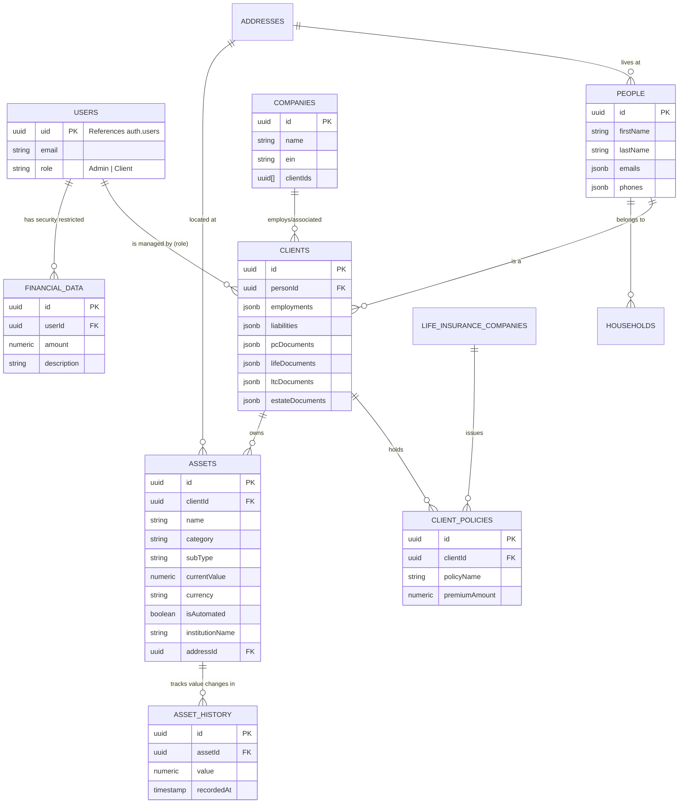

# Database

This document details the database schema, security rules, and data access patterns for the Prestige Box application.

## Schema Overview

The database is built on **PostgreSQL** hosted by Supabase. Schema definitions and migrations are managed by **Drizzle ORM**.

## Core Entities

### `users`
- Maps to Supabase's internal `auth.users` table.
- Stores custom application-specific roles (`admin`, `client`) and basic profile data.

### `people`
- A master record of a physical person. This table tracks names, contact information (JSONB arrays), PII, and associated `addresses`.

### `clients`
- Represents a customer relationship. Every `client` maps to exactly one `person` (`personId`), but a `person` is not necessarily a `client` (e.g., they could be an associate or family member).
- Stores deep financial data such as employments, liabilities (loans/mortgages), and specialized documents (PC, Life, LTC, Estate) stored as JSONB arrays.

### `companies` & `insurance_companies`
- Separates general companies (employers, owned businesses) from specialized insurance providers (Life, Disability, Long Term Care).
- Many-to-Many relationships to clients are primarily handled via `uuid` arrays (e.g., `clientIds`).

### `addresses`
- Tracks physical and mailing addresses associated with people, households, companies, and assets.

### `households`
- Groups multiple individuals (people) together into households to represent family groups for financial advisory and net worth aggregation.

### `client_policies`
- Stores individual client policy records for Life, Disability, and Long Term Care insurance, detailing premium amounts, renewal dates, and payment schedules.

### `law_firms`, `accounting_firms`, `actuarial_firms`, `banks`, `property_and_casualty_firms`
- Represent professional service provider firms associated with both clients and companies. Track contact info and arrays of associated client/company IDs.

### `money_managers`, `record_keepers`
- Represent specialized financial vendors managing client accounts and policy allocations, connected via client and company reference arrays.

### `assets`
- Tracks physical assets owned by clients (e.g., primary residences, investment properties, vehicles, and valuables).
- Supports manual updates or automated integration (e.g., via financial institution linking). Can optionally link to `addresses` for real estate properties.

### `asset_history`
- Logs historical value snapshots for client assets. Used to build chronological timelines for net worth tracking and visualization.

### `financial_data`
- Template/example financial data records for users, strictly protected by AAL2 RLS policies.

## Drizzle ORM

The schema is defined in TypeScript at `src/db/schema.ts`. Drizzle Kit is used to generate SQL migrations from this file.

### Migrations & Pushing
- Schema updates are applied via `pnpm run drizzle-kit push` or `pnpm run drizzle-kit generate` depending on the environment.
- The `src/db/migrate.ts` file handles automated migration execution.

### Local Seeding
- To spin up a local environment quickly, a robust seeding script is provided at `src/db/seed.ts`.
- It utilizes `@faker-js/faker` to generate hundreds of realistic records across all tables (People, Companies, Policies, etc.).
- Run the seeder with: `pnpm run db:seed`.

## Security & Row Level Security (RLS)

All database access from the client side requires explicit Row Level Security policies.

- **MFA (AAL2) Enforcement**: Access to highly sensitive tables (e.g., `assets`, `asset_history`, and `financial_data`) requires strict Multi-Factor Authentication. Policies verify that the Authenticator Assurance Level (`aal`) claim in the session JWT is `'aal2'`: `USING (((SELECT auth.jwt() ->> 'aal') = 'aal2'))`. Requests made with only single-factor authentication (`aal1`) are rejected at the database level.
- **Supabase Dashboards:** When testing queries in the Supabase Dashboard SQL Editor, RLS is bypassed. Always test via the client application or a dedicated authenticated service role.
- **Subquery Cache Optimization:** For performance, RLS rules avoid raw `auth.uid()` checks directly in the `USING` clause, instead preferring wrapped subqueries (e.g., `USING ((SELECT auth.uid()) = user_id)`) to enforce query caching.
- **Service Role:** The Supabase Service Role key is strictly reserved for secure Edge Functions or Next.js server actions that require administrative bypass. It is never exposed to the client bundle.
