# Database

This document details the database schema, security rules, and data access patterns for the Prestige Box application.

## Schema Overview

The database is built on **PostgreSQL** hosted by Supabase. Schema definitions and migrations are managed by **Drizzle ORM**.

```mermaid
erDiagram
    USERS ||--o{ CLIENTS : "is managed by (role)"
    USERS ||--o{ FINANCIAL_DATA : "has security restricted"
    PEOPLE ||--o{ CLIENTS : "is a"
    PEOPLE ||--o{ HOUSEHOLDS : "belongs to"
    ADDRESSES ||--o{ PEOPLE : "lives at"
    COMPANIES ||--o{ CLIENTS : "employs/associated"
    CLIENTS ||--o{ CLIENT_POLICIES : "holds"
    LIFE_INSURANCE_COMPANIES ||--o{ CLIENT_POLICIES : "issues"
    DISABILITY_INSURANCE_COMPANIES ||--o{ CLIENT_POLICIES : "issues"
    LONG_TERM_CARE_INSURANCE ||--o{ CLIENT_POLICIES : "issues"
    CLIENTS ||--o{ ASSETS : "owns"
    ADDRESSES ||--o{ ASSETS : "located at"
    ASSETS ||--o{ ASSET_HISTORY : "tracks value changes in"
    
    COMPANIES ||--o{ COMPANY_VALUATION_HISTORY : "has valuations"
    COMPANIES ||--o{ COMPANY_OWNERS : "has owners"
    PEOPLE ||--o{ COMPANY_OWNERS : "owns equity"
    
    USERS ||--o{ TASKS : "creates"
    TASKS ||--o{ TASK_ASSIGNEES : "assigned to"
    USERS ||--o{ TASK_ASSIGNEES : "gets tasks"
    TASKS ||--o{ TASK_ASSOCIATIONS : "links entity"
    
    USERS ||--o{ NOTES : "writes"
    NOTES ||--o{ NOTES : "parent/replies"
    NOTES ||--o{ NOTE_ASSOCIATIONS : "links entity"
    NOTES ||--o{ NOTE_ATTACHMENTS : "has uploads"
    NOTES ||--o{ NOTE_REACTIONS : "gets emoji"
    NOTES ||--o{ NOTE_VOTES : "voted by"
    NOTES ||--o{ NOTE_NOTIFICATIONS : "alerts user"
    
    USERS ||--o{ CHANGE_HISTORY : "acts on (actorId)"
    
    USERS {
        uuid uid PK "References auth.users"
        string email
        string role "Admin | Advisor | Client"
        string firstName
        string lastName
    }
    PEOPLE {
        uuid id PK
        string firstName
        string lastName
        jsonb emails
        jsonb phones
    }
    CLIENTS {
        uuid id PK
        uuid personId FK
        uuid advisorId FK "References users"
        jsonb employments
        jsonb liabilities
        jsonb pcDocuments
        jsonb lifeDocuments
        jsonb ltcDocuments
        jsonb estateDocuments
    }
    COMPANIES {
        uuid id PK
        string name
        string dba
        string ein
        uuid addressId FK
        string website
        string phone
        uuid advisorId FK "References users"
        jsonb situsRecords
        jsonb nexusRecords
        jsonb paymentAccounts
        jsonb lifeDocuments
        jsonb disabilityDocuments
        jsonb ltcDocuments
        string logoUrl
        jsonb socialMedia
        string documentUrl
        numeric estimatedValue
        timestamp createdAt
        timestamp updatedAt
    }
    COMPANY_VALUATION_HISTORY {
        uuid id PK
        uuid companyId FK
        numeric valuation
        timestamp recordedAt
    }
    COMPANY_OWNERS {
        uuid id PK
        uuid companyId FK
        uuid personId FK
        numeric ownershipPercentage
    }
    TASKS {
        uuid id PK
        string name
        string status "New | In Process | Waiting Input | Complete"
        string category "Other | Birthday | Wedding Anniversary | Policy Renewal"
        string priority "Low | Medium | High"
        string description "Tiptap HTML"
        jsonb attachments
        timestamp dueDate
        timestamp completeDate
        string source "manual | auto"
        string sourceType "birthday | anniversary | renewal"
        string sourceRefId "anchor ID"
        uuid createdBy FK "References users"
        timestamp createdAt
        timestamp updatedAt
    }
    TASK_ASSIGNEES {
        uuid id PK
        uuid taskId FK
        uuid userId FK "References users"
        timestamp createdAt
    }
    TASK_ASSOCIATIONS {
        uuid id PK
        uuid taskId FK
        string entityType "client | company"
        uuid entityId
        timestamp createdAt
    }
    NOTES {
        uuid id PK
        uuid parentId FK "self-reference"
        uuid rootId FK "self-reference"
        integer depth
        string title "Only on top-level notes"
        string body "Tiptap HTML"
        uuid authorId FK "References users"
        integer score
        boolean isDeleted
        timestamp createdAt
        timestamp updatedAt
    }
    NOTE_ATTACHMENTS {
        uuid id PK
        uuid noteId FK
        string kind "file | link"
        string fileUrl
        string fileName
        integer fileSize
        string mimeType
        string linkUrl
        string linkTitle
        string linkFavicon
        string linkProvider "google-drive | web"
        timestamp createdAt
    }
    NOTE_REACTIONS {
        uuid id PK
        uuid noteId FK
        uuid userId FK "References users"
        string emoji
        timestamp createdAt
    }
    NOTE_VOTES {
        uuid id PK
        uuid noteId FK
        uuid userId FK "References users"
        integer value "1 | -1"
        timestamp createdAt
    }
    NOTE_NOTIFICATIONS {
        uuid id PK
        uuid noteId FK
        uuid rootId FK
        uuid recipientId FK "References users"
        uuid actorId FK "References users"
        string actorName
        string type "mention | reply"
        string preview
        boolean isRead
        timestamp createdAt
    }
    CHANGE_HISTORY {
        uuid id PK
        string entityType "client | company | task"
        uuid entityId
        string subType "Profile | Life Insurance | etc"
        string action "created | updated | added | removed | deleted"
        string fieldName
        string fieldLabel
        string oldValue
        string newValue
        string summary
        uuid actorId FK "References users"
        string actorName
        timestamp changedAt
        timestamp createdAt
    }
    
    WORKFLOW_TEMPLATES ||--o{ WORKFLOW_TEMPLATE_STEPS : "contains"
    WORKFLOW_TEMPLATES ||--o{ WORKFLOW_INSTANCES : "instantiates"
    WORKFLOW_INSTANCES ||--o{ WORKFLOW_INSTANCE_STEPS : "contains"
    OPPORTUNITY_PIPELINES ||--o{ OPPORTUNITY_PIPELINE_STAGES : "contains"
    OPPORTUNITY_PIPELINES ||--o{ OPPORTUNITIES : "contains"
    OPPORTUNITY_PIPELINE_STAGES ||--o{ OPPORTUNITIES : "tracks stage of"
    CLIENTS ||--o{ OPPORTUNITIES : "associated with"
    COMPANIES ||--o{ OPPORTUNITIES : "associated with"

    WORKFLOW_TEMPLATES {
        uuid id PK
        string name
        string description
        uuid createdBy FK "References users"
        jsonb graph
        timestamp createdAt
        timestamp updatedAt
    }
    WORKFLOW_TEMPLATE_STEPS {
        uuid id PK
        uuid templateId FK
        string name
        integer sortOrder
        boolean setDueDate
        integer dueDays
        string dueDateBase "workflow_start | after_last_step"
        string priority "None | Low | Medium | High"
        string description
        string responsibility "advisor | client"
        jsonb attachments
        jsonb outcomes
        numeric positionX
        numeric positionY
        timestamp createdAt
        timestamp updatedAt
    }
    WORKFLOW_INSTANCES {
        uuid id PK
        uuid templateId FK
        string name
        string description
        string entityType "client | company"
        uuid entityId
        timestamp startDate
        uuid createdBy FK
        timestamp completedAt
        uuid completedBy FK
        timestamp createdAt
        timestamp updatedAt
    }
    WORKFLOW_INSTANCE_STEPS {
        uuid id PK
        uuid instanceId FK
        string name
        integer sortOrder
        boolean setDueDate
        integer dueDays
        string dueDateBase
        string priority
        string description
        string responsibility
        jsonb attachments
        timestamp dueDate
        timestamp completedAt
        uuid completedBy FK
        uuid templateStepId FK
        jsonb outcomes
        jsonb selectedOutcome
        timestamp createdAt
        timestamp updatedAt
    }
    OPPORTUNITY_PIPELINES {
        uuid id PK
        string name
        boolean isActive
        timestamp createdAt
        timestamp updatedAt
    }
    OPPORTUNITY_PIPELINE_STAGES {
        uuid id PK
        uuid pipelineId FK
        string name
        integer order
        timestamp createdAt
        timestamp updatedAt
    }
    OPPORTUNITIES {
        uuid id PK
        uuid clientId FK
        uuid companyId FK
        numeric amount
        timestamp targetCloseDate
        uuid pipelineId FK
        uuid stageId FK
        integer probabilityWin
        string notes
        string resultStatus "TRASH | WON | LOST"
        string resultNotes
        uuid updatedById FK
        timestamp createdAt
        timestamp updatedAt
    }
```

## Core Entities

### `users`
- Maps to Supabase's internal `auth.users` table.
- Stores custom application-specific roles (`admin`, `advisor`, `client`) and basic profile details like name, phone, and profile photo URL.

### `people`
- A master record of a physical person. Tracks names, contact information (JSONB arrays), PII, and household associations.

### `clients`
- Represents a customer relationship. Maps to exactly one `person` (`personId`), and tracks advisor assignments (`advisorId` referencing `users.uid`).
- Stores deep financial profiles (employment, liabilities) and insurance files.
- **Estate Planning Documents**: The `estateDocuments` column has been upgraded to a structured JSONB repository supporting multiple estate planning document types with specific schema fields:
  - **Types**: Supports `Will`, `Revocable Trust`, `Irrevocable Trust`, and `Other`.
  - **Will Schema**: Tracks `effectiveDate` (YYYY-MM-DD), `beneficiaries` (text), and a `files` array of documents (`id`, `name`, `url`, `uploadedAt`).
  - **Trust Schema**: Tracks the `trustName`, `effectiveDate`, `amendmentDate`, `attorneyFirmId` (linking to a law firm), `grantor` and `trustees` (party reference objects with `kind` as `person` or `company` and `id` linking to their record), `beneficiaries` (text), and the `files` array.
  - **Other Schema**: Tracks custom `description` (text) and the `files` array.

### `client_policies` & `insurance_vendors`
- **Policies**: `client_policies` tracks a client's Life, Disability, and Long-Term Care policies, detailing policy numbers, premium amounts, effective and renewal dates, and payment schedules.
- **Vendors**: Tracks insurance companies (`life_insurance_companies`, `disability_insurance_companies`, `long_term_care_insurance`) with name, website, phone contacts, and relationships to individuals and corporate clients.

### `companies` & sub-tables (`company_valuation_history`, `company_owners`)
- Tracks general corporate clients and business entities.
- Upgraded with fields for corporate details (situs/nexus records as JSONB `situsRecords` and `nexusRecords`, website, phone, payment accounts, dba, estimatedValue, logoUrl, socialMedia, documentUrl) and document categories (`lifeDocuments`, `disabilityDocuments`, `ltcDocuments`).
- Tethers to an assigned advisor (`advisorId` referencing `users.uid`).
- **Valuation History**: Logs historical valuation snapshots in `company_valuation_history` to build valuation curves.
- **Ownership Equity**: Tracks cap table records in `company_owners` tying physical individuals (`people.id`) to corporate entities with decimal ownership percentages.

### `tasks` & sub-tables (`task_assignees`, `task_associations`)
- Manages standard advisory workflows.
- Idempotency is strictly guarded via a unique database index: `uq_tasks_auto_anchor` (`sourceType`, `sourceRefId`), preventing duplicate generation of birthday, anniversary, or policy renewal tasks.
- **Assignees**: Links multiple active users to a single task via `task_assignees`.
- **Contextual Links**: Connects a task to clients or companies using `task_associations`.

### `notes` & sub-tables (`note_attachments`, `note_reactions`, `note_votes`, `note_notifications`)
- reddit-style nested threaded workspace.
- **Hierarchical Self-References**: Each record points to a parent note (`parentId` for direct replies) and a root thread (`rootId` for depth-independent rendering).
- **Rich attachments**: Links static binary uploads or dynamic web-crawled/Google Drive links via `note_attachments`.
- **Community Ratings**: Tracks up/down voting scores through `note_votes` (using the `value` column) and emoji counts in `note_reactions`.
- **In-App Notifications**: Stores unread mention/reply triggers in `note_notifications` linked to user recipients.

### `change_history`
- System-wide audit log mapping all mutations across CRM entities (clients, companies, tasks).
- Logs the semantic sub-type (e.g. Profile, Life Insurance, Valuation), action (`created`, `updated`, `added`, `removed`, `deleted`), specific changed fields with machine and human-readable names (`fieldName`, `fieldLabel`), before/after string snapshots (`oldValue`, `newValue`), a custom text `summary`, and details of the actor (`actorId`, `actorName`) and timestamp.

### `workflow_templates` & `workflow_template_steps`
- **Templates**: Tracks workflow designs created by admins. Stores the workflow name, description (Tiptap HTML), creator, and the visual flow schema representation (stored as a React Flow JSONB `graph` object detailing node coordinates and edge connections).
- **Template Steps**: The individual task definitions making up a template. Tracks `sortOrder`, due date calculation rules (`setDueDate`, `dueDays`, and `dueDateBase` as `workflow_start` or `after_last_step`), priority, responsibility (`advisor` or `client`), rich descriptions, attachments, outcomes (JSONB metadata mapping path branches), and editor positions (`positionX`, `positionY`).

### `workflow_instances` & `workflow_instance_steps`
- **Instances**: Snapshot copies of a workflow template instantiated and assigned to a client or company. Tracks overall completion dates, creators, and progress.
- **Instance Steps**: Snapshot of the template step with completion tracking. Resolves the due date using the cascading completion timeline (`dueDate`), tracks when and who completed the step, and logs `outcomes` and `selectedOutcome` configurations.

### `opportunity_pipelines` & `opportunity_pipeline_stages`
- **Pipelines**: Tracks opportunity pipelines (e.g., onboarding, sales lifecycle).
- **Pipeline Stages**: The stages making up a pipeline, ordered by `order`.

### `opportunities`
- Represents a sales, onboarding, or policy lifecycle deal. Maps to a client or company.
- Tracks `amount` (numeric), `targetCloseDate`, `probabilityWin` (integer), `notes`, `resultStatus` (`TRASH`, `WON`, `LOST`), and `resultNotes`.
- Enforces database constraints pointing to the active pipeline (`pipelineId`) and stage (`stageId`).

---

## Drizzle ORM

The schema is defined in TypeScript at `src/db/schema.ts`. Drizzle Kit is used to generate SQL migrations.

### Migrations & Pushing
- Schema updates are applied via `pnpm drizzle-kit push` or `pnpm drizzle-kit generate` depending on the environment.
- The `src/db/migrate.ts` file handles automated migration execution.

### Local Seeding
- To spin up a local environment quickly, a seeding script is provided at `src/db/seed.ts`.
- Generates realistic records across all tables (People, Companies, Policies, Notes, Tasks, and Valuations).
- Run the seeder with: `pnpm run db:seed`.

---

## Security & Row Level Security (RLS)

All database access from the client side requires explicit Row Level Security policies.

- **MFA (AAL2) Enforcement**: Access to highly sensitive tables (e.g., `assets`, `asset_history`, and `financial_data`) requires strict Multi-Factor Authentication. Policies verify that the Authenticator Assurance Level (`aal`) claim in the session JWT is `'aal2'`: `USING (((SELECT auth.jwt() ->> 'aal') = 'aal2'))`. Requests made with only single-factor authentication (`aal1`) are rejected at the database level.
- **Collaborative Modules RLS**: Tables like `notes`, `tasks`, `change_history`, and their related tables allow read/write access to all `authenticated` users. More granular business logic validation (e.g., preventing a client from reading internal notes) is enforced at the application level to support rich team collaboration.
- **Subquery Cache Optimization**: RLS rules avoid raw `auth.uid()` checks directly in the `USING` clause, instead preferring wrapped subqueries (e.g., `USING ((SELECT auth.uid()) = user_id)`) to enforce query caching.
- **Service Role**: The Supabase Service Role key is strictly reserved for secure Edge Functions or Next.js server actions that require administrative bypass. It is never exposed to the client bundle.

