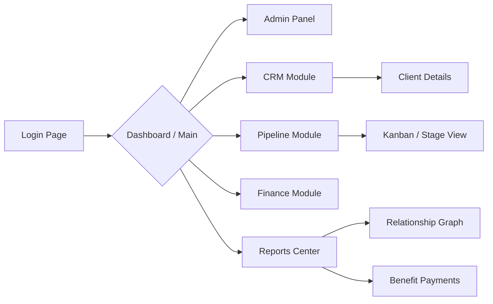

# Application Features

This document outlines the primary features and modules available within the Prestige Box dashboard.

## Dashboard (`/dashboard`)

The main entry point for authenticated users. It serves as a central hub navigating to all distinct business verticals of Prestige Box.

### 1. Admin Panel (`/dashboard/admin`)
Reserved for system administrators.
- **User Management**: Creating and disabling user accounts.
- **Role Assignment**: Managing permissions between `admin` and `client` roles.

### 2. CRM Module (`/dashboard/crm`)
The core relationship management suite.
- **Client List**: High-level table of managed clients with search, creation, and navigation links.
- **Client Profile & Contextual Navigation**: Selecting a client dynamically switches the sidebar to a tailored client-centric navigation menu containing:
  - **Overview & Profile (`/dashboard/crm/clients/[id]`)**: Contact details card, personal info (hobbies, sports teams), and interactive Net Worth timeline graph.
  - **Internal Notes (`/dashboard/crm/clients/[id]/internal`)**: Private logging of staff notes and client briefs.
  - **Family Tab (`/dashboard/crm/clients/[id]/family`)**: Structure family connections (spouse, parent, child, etc.) and link them directly to system profiles.
  - **Employment (`/dashboard/crm/clients/[id]/employment`)**: Manage employment records, employers, compensation, and active statuses.
  - **Estate Planning (`/dashboard/crm/clients/[id]/estate-planning`)**: Tracks wills, trusts, medical directives, power of attorney, and other documents.
  - **Assets (`/dashboard/crm/clients/[id]/assets`)**: Custom tracking of client assets (Real Estate, Vehicles, Valuables, etc.) including current market value, address linking, and value history snapshots.
  - **Liabilities (`/dashboard/crm/clients/[id]/liabilities`)**: Manage client debts (Auto loans, mortgages, business lines of credit) with banking associations, balances, and statement uploads.
  - **Professional Associations**: Associate/unlink external service providers:
    - Accounting Firms (`/[id]/accounting-firms`)
    - Actuarial Firms (`/[id]/actuarial-firms`)
    - Banks (`/[id]/banks`)
    - Law Firms (`/[id]/law-firms`)
    - Property & Casualty (`/[id]/property-and-casualty`)
  - **Policies & Managed Accounts**: Track insurance policies and asset management accounts:
    - Life Insurance (`/[id]/life-insurance`)
    - Disability Insurance (`/[id]/disability-insurance`)
    - Long-Term Care (`/[id]/long-term-care`)
    - Money Managers (`/[id]/money-managers`)
    - Record Keepers (`/[id]/record-keepers`)

### 3. CRM Pipeline (`/dashboard/crm-pipeline`)
A visual management tool for tracking sales, onboarding, or policy lifecycles.
- Tracks prospects through distinct stages of acquisition.
- Smooth transitions from prospect to active client.

### 4. Finance Module (`/dashboard/finance`)
Dedicated space for managing overall corporate numbers and client insurance policies.
- **Policies**: Overall management of Life, Disability, and Long Term Care insurance policies.
- **Premiums & Renewals**: Premium schedules, critical renewal dates, and payment history.
- **Liabilities & Mortgages**: Visualizations of client liabilities.

### 5. Reports Center (`/dashboard/reports`)
Dynamic reporting and analytical views.
- **Relationship Graph**: Interactive SVG representation mapping the connections between a Client, their companies, and associated professional service firms.
- **Benefit Payments**: Detailed breakdowns of expected or historical benefit payouts from managed policies.

### 6. User Profile (`/dashboard/profile`)
Personal settings page for the currently authenticated user.
- Photo and demographic updates.
- Account security settings.

### 7. Client Onboarding Setup Flow (`/auth/v1/client-setup`)
Secure client-specific onboarding pathway.
- Custom setup page to welcome new clients and verify identity.
- Enforces strict application password requirements (length, special characters).
- Authenticated logger tracking onboarding flow completions.
