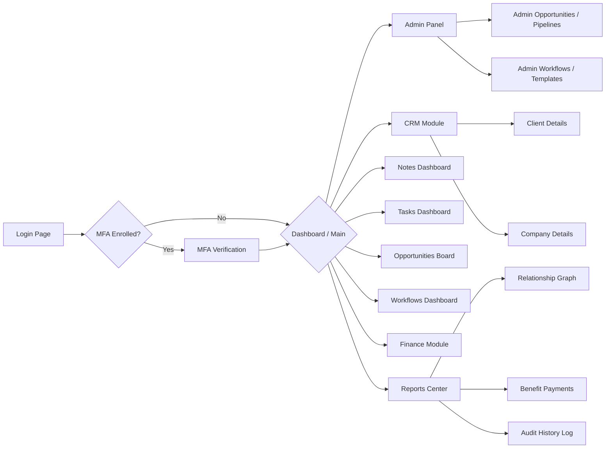

# Application Features

This document outlines the primary features and modules available within the Prestige Box dashboard.

## Dashboard (`/dashboard`)

The main entry point for authenticated users. It serves as a central hub navigating to all distinct business verticals of Prestige Box.

### 1. Admin Panel (`/dashboard/admin`)
Reserved for system administrators.
- **User Management**: Creating and disabling user accounts.
- **Role Assignment**: Managing permissions between `admin` and `client` roles.
- **Portal Settings**: Global portal-wide configuration parameters.
- **Workflow Templates (`/dashboard/admin/workflows`)**: Flow designer and form builder to define visual multi-step workflow graphs with custom branches and outcomes.
- **Opportunity Pipelines (`/dashboard/admin/opportunities`)**: Configuration settings to create, reorder, or disable pipelines and pipeline stages.

### 2. CRM Module (`/dashboard/crm`)
The core relationship management suite.

- **General CRM Dashboards**:
  - **Overview Dashboard (`/dashboard/crm`)**: Summary stats of total profiles, households, clients, and monthly revenue projection, with quick navigation cards.
  - **Notes Dashboard (`/dashboard/crm/notes`)**: Global registry of threaded client/company notes, replies, mentions, and notifications.
  - **Tasks Dashboard (`/dashboard/crm/tasks`)**: Global Kanban board and spreadsheet list for managing all manual and auto-generated workflows.
  - **Opportunities Dashboard (`/dashboard/crm/opportunities`)**: Sales pipeline Kanban and list view for deals, onboarding, and policy transitions.
  - **Workflows Dashboard (`/dashboard/crm/workflows`)**: Central hub listing active and completed workflow instances assigned to clients or companies.
  - **People (`/dashboard/crm/people`)**: Central directory of all individual profiles (clients, prospects, family members, professional contacts) with search, creation, and profile navigation.
  - **Addresses (`/dashboard/crm/addresses`)**: Manages physical address records linked to people, households, companies, and assets.
  - **Households (`/dashboard/crm/households`)**: Groups individuals into family/household units to track aggregate net worth and familial links.
  - **Clients (`/dashboard/crm/clients`)**: Advisor-focused portfolio view of all active clients.
  - **Companies (`/dashboard/crm/companies`)**: Tracks general corporate entities, employers, and client business associations.
  - **Policies (`/dashboard/crm/policies`)**: Central registry for all Life, Disability, and Long-Term Care insurance policies, detailing premiums, effective dates, and payment schedules.

- **Client Profile & Contextual Navigation**: Selecting a client dynamically switches the sidebar to a tailored client-centric navigation menu containing:
  - **Overview & Profile (`/dashboard/crm/clients/[id]`)**: Contact details card, personal info (hobbies, sports teams), and interactive Net Worth timeline graph.
  - **Family Tab (`/dashboard/crm/clients/[id]/family`)**: Structure family connections (spouse, parent, child, etc.) and link them directly to system profiles.
  - **Employment (`/dashboard/crm/clients/[id]/employment`)**: Manage employment records, employers, compensation, and active statuses.
  - **Estate Planning (`/dashboard/crm/clients/[id]/estate-planning`)**: Tracks estate planning instruments (Wills, Revocable/Irrevocable Trusts, and other custom documents) in a structured metadata repository. Integrates a searchable autocomplete picker (built on Radix/Base UI Combobox primitives) to link grantors and trustees (either individuals/people or corporate entities/companies) and external legal advisors (law firms). Supports multi-file uploads per repository.
  - **Assets (`/dashboard/crm/clients/[id]/assets`)**: Custom tracking of client assets (Real Estate, Vehicles, Valuables, etc.) including current market value, address linking, and value history snapshots.
  - **Liabilities (`/dashboard/crm/clients/[id]/liabilities`)**: Manage client debts (Auto loans, mortgages, business lines of credit) with banking associations, balances, and statement uploads.
  - **Professional Associations**: Associate/unlink external service providers:
    - Accounting Firms (`/dashboard/crm/clients/[id]/accounting-firms`)
    - Actuarial Firms (`/dashboard/crm/clients/[id]/actuarial-firms`)
    - Banks (`/dashboard/crm/clients/[id]/banks`)
    - Law Firms (`/dashboard/crm/clients/[id]/law-firms`)
    - Property & Casualty (`/dashboard/crm/clients/[id]/property-and-casualty`)
  - **Policies & Managed Accounts**: Track insurance policies and asset management accounts:
    - Life Insurance (`/dashboard/crm/clients/[id]/life-insurance`)
    - Disability Insurance (`/dashboard/crm/clients/[id]/disability-insurance`)
    - Long-Term Care (`/dashboard/crm/clients/[id]/long-term-care`)
    - Money Managers (`/dashboard/crm/clients/[id]/money-managers`)
    - Record Keepers (`/dashboard/crm/clients/[id]/record-keepers`)
  - **Internal Workspace (`/dashboard/crm/clients/[id]/internal`)**: Private advisor notes, tasks, and audit logs:
    - **Internal Notes (`/dashboard/crm/clients/[id]/internal/notes`)**: Collaborative client logs.
    - **Internal Tasks (`/dashboard/crm/clients/[id]/internal/tasks`)**: Tasks associated with this client.
    - **Internal Opportunities (`/dashboard/crm/clients/[id]/internal/opportunities`)**: Sales and onboarding opportunities linked to this client.
    - **Internal History (`/dashboard/crm/clients/[id]/internal/history`)**: Chronological audit trail of changes made to the client's profile.

- **Company Profile & Contextual Navigation**: Selecting a company dynamically switches the sidebar to a tailored company-centric navigation menu containing:
  - **General Overview (`/dashboard/crm/companies/[id]`)**: Details company info, including EIN, website, phone, situs/nexus records, and associated client list.
  - **Valuation History (`/dashboard/crm/companies/[id]/valuation`)**: Tracks historical company values and plots an interactive company valuation timeline.
  - **Payment Accounts & Documents Tab**: Managed tab for company-specific premium payment accounts, and documents folders (Life, Disability, LTC) with file upload capability.
  - **Professional Services**: Link and manage associated service firms specific to that company (Accounting, Actuarial, Banks, Law, Property & Casualty).
  - **Vendors**: Manage company-linked vendors (Life, Disability, LTC insurance companies, Money Managers, Record Keepers).
  - **Internal Workspace (`/dashboard/crm/companies/[id]/internal`)**: Private workspace containing Company Notes (`/notes`), Company Tasks (`/tasks`), Company Opportunities (`/opportunities`), and Audit History logs (`/history`).

### 3. Threaded Notes System (`/dashboard/crm/notes`)
A Reddit-style threaded collaboration space for admins and advisors to share knowledge and discuss client/company matters.
- **Hierarchical Threads**: Supports multi-depth notes (up to 2 levels: note, reply, sub-reply) with denormalized thread retrieval.
- **Rich Context**: Supports Tiptap WYSIWYG editor for body composing, custom emoji picking, files and Google Drive link previews, upvoting/downvoting (aggregating scores), and user mentions (`@username`).
- **Notification Inbox**: Triggers real-time and persistent alerts (mention, reply) in the user's notification bell.

### 4. Task Management System (`/dashboard/crm/tasks`)
A workflows board and spreadsheet view to track advisory deliverables and automate standard client events.
- **Interactive Kanban**: Task Board (`/dashboard/crm/tasks`) organizes tasks into status columns (New, In Process, Waiting Input, Complete) with drag-and-drop triggers.
- **Client & Company Links**: Tasks can be linked to multiple CRM entities for direct contextual lookup.
- **Auto-Generation Engine**: Performs daily idempotent background sync (via `/api/cron/sync-tasks`) to auto-create and renew recurring tasks:
  - **Birthdays**: Tripped by a client profile's date of birth.
  - **Anniversaries**: Tripped by the Spouse's `marriageDate` in the client's family data.
  - **Policy Renewals**: Tripped by an active insurance policy's next renewal date.
- **Assignee Routing**: Auto-tasks route directly to the client's assigned advisor (`advisorId`). Unassigned tasks flag on the global board for team pickup.

### 5. CRM Opportunities & Pipelines (`/dashboard/crm/opportunities`)
An interactive deal tracking board and table view to manage sales pipelines, client onboarding cycles, and policy transitions.
- **Interactive Kanban Stage-View**: Visualizes all active deals/opportunities categorized into columns matching their pipeline stage. Drag-and-drop actions automatically trigger stage transitions.
- **Pipeline and Stage Settings**: Admins can customize pipelines and order stages under the Admin Panel (`/dashboard/admin/opportunities`).
- **Associations**: Opportunities are mapped directly to either a Client or a Company.
- **Outcome Statuses**: Track won/lost status with win probabilities, estimated amounts, close dates, and WYSIWYG notes detailing the outcome.

### 6. Finance Module (`/dashboard/finance`)
Dedicated space for managing overall corporate numbers and client insurance policies.
- **Policies**: Overall management of Life, Disability, and Long Term Care insurance policies.
- **Premiums & Renewals**: Premium schedules, critical renewal dates, and payment history.
- **Liabilities & Mortgages**: Visualizations of client liabilities.

### 7. Reports Center (`/dashboard/reports`)
Dynamic reporting and analytical views.
- **Benefit Payments (`/dashboard/reports/payments`)**: Tracks expected premium payments, collections, and forecasts.
- **Relationship Graph (`/dashboard/reports/relationship-graph`)**: Interactive SVG representation mapping the connections between a Client, their companies, and associated professional service firms.
- **History Report (`/dashboard/reports/history`)**: Global feed of audit history logs tracking mutations (insert/updates/deletions) across CRM entities.

### 8. User Settings & Security (`/dashboard/settings`, `/dashboard/profile`)
Personal configuration pages for the authenticated user.
- **Profile (`/dashboard/profile`)**: Updates for photos, name, and demographic info.
- **Security Settings (`/dashboard/settings`)**: View active authentication factors, enroll in Two-Factor Authentication (TOTP), and register native WebAuthn Passkeys for secure passwordless login.

### 9. Multi-Factor Authentication (MFA) Flows
Strict authentication gates using Supabase MFA.
- **Enrollment (`/auth/mfa-enroll`)**: Screen for generating and enrolling a TOTP factor. Displays a dynamic QR code and manual setup key, demanding a 6-digit confirmation code from the authenticator app to activate the factor.
- **Verification (`/auth/mfa-verify`)**: Mandatory challenge page for users with verified factors who are at the single-factor level (`aal1`), requiring a 6-digit TOTP code to elevate their session to `aal2`.

### 10. Client Onboarding Setup Flow (`/auth/v1/client-setup`)
Secure client-specific onboarding pathway.
- Custom setup page to welcome new clients and verify identity.
- Enforces strict application password requirements (length, special characters).
- Authenticated logger tracking onboarding flow completions.

### 11. Authentication & Registration Entrypoints
The application provides modern, secure access control via multiple options:
- **Credential Sign-In & Sign-Up**: Secure login (`/login`) and account registration (`/login/create-account`) backed by strict validation and database status checks.
- **Passwordless Device Passkeys**: Users can register and sign in seamlessly using native WebAuthn Passkeys (FaceID, TouchID, or hardware security keys) bypassing passwords entirely.
- **Social OAuth Integration**: Quick authentication using third-party identity providers (Google and Microsoft Azure AD) for unified corporate identity.

### 12. Workflow Automation Engine (`/dashboard/crm/workflows`)
A Visual Graph-based automation system for orchestrating complex client onboarding, insurance placements, and annual review procedures.
- **Visual Builder (`/dashboard/admin/workflows`)**: Admins can visually design templates with step nodes and directional connection edges. Relies on `@xyflow/react` for custom drag-and-drop canvas configurations, layouts, and branching paths.
- **Cascading Step Due Dates**: Step deadlines cascades forward dynamically. Completed steps automatically anchor and project next step deadlines relative to their `dueDays` and `dueDateBase`.
- **Progress Tracking**: Computes progress completion percentages dynamically using a Breadth-First Search (BFS) algorithm to calculate step distance to the "end" node in the workflow graph template.
- **Assigned Contexts**: Workflow instances are copy-snapshotted from templates and assigned to a specific Client or Company. Runs advisor-only or client-focused actions (defined via step responsibility settings).
