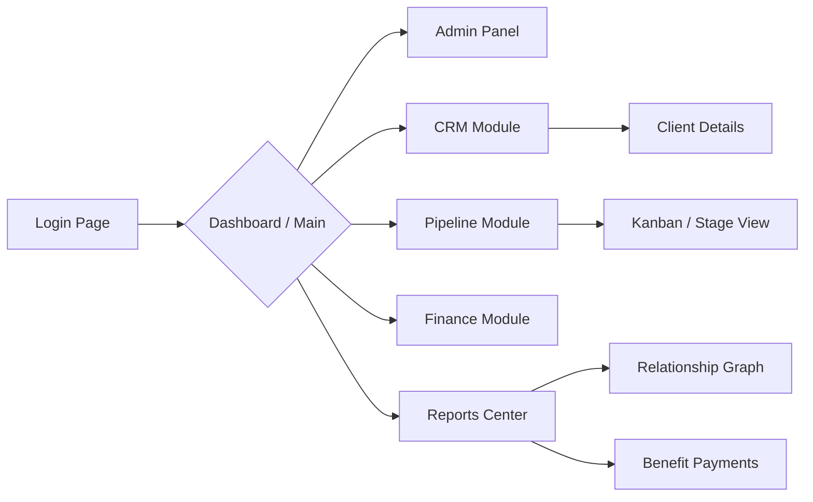

# Application Features

This document outlines the primary features and modules available within the Prestige Box dashboard.

## Dashboard (`/dashboard`)

The main entry point for authenticated users. It serves as a central hub navigating to all distinct business verticals of Prestige Box.

### 1. Admin Panel (`/dashboard/admin`)
Reserved for system administrators.
- **User Management**: Creating and disabling user accounts.
- **Role Assignment**: Managing permissions between `admin` and `client` roles.

### 2. CRM Module (`/dashboard/crm`)
The core relationship management suite.
- **Client Profiles**: Deep tracking of individuals, managing their contact information (phones, emails, addresses).
- **Associated Entities**: Tracking connected Households, Law Firms, Accounting Firms, Actuarial Firms, and Money Managers.
- **Personal Details**: Hobbies, favorite sports teams, and familial relationships.

### 3. CRM Pipeline (`/dashboard/crm-pipeline`)
A visual management tool for tracking sales, onboarding, or policy lifecycles.
- Allows tracking of prospects through distinct stages of acquisition.
- Integrated heavily with Client profile data to ensure smooth transitions from prospect to active client.

### 4. Finance Module (`/dashboard/finance`)
Dedicated space for managing hard numbers and policies.
- **Policies**: Tracking Life, Disability, and Long Term Care insurance policies attached to clients.
- **Premiums & Renewals**: Tracking premium amounts, payment schedules, and critical renewal dates.
- **Liabilities & Mortgages**: Recording detailed financial liabilities.

### 5. Reports Center (`/dashboard/reports`)
Dynamic reporting and analytical views.
- **Relationship Graph**: A visual representation mapping complex connections between a Client, their associated Companies, and specialized Firms.
- **Benefit Payments**: Detailed breakdowns of expected or historical benefit payouts from managed policies.

### 6. User Profile (`/dashboard/profile`)
Personal settings page for the currently authenticated user.
- Photo and demographic updates.
- Account security settings.
